# Hack The Box Sherlock - Fruitzy


(https://labs.hackthebox.com/achievement/sherlock/3007654/1212)
---


# Índice

- Información General
- Herramientas Utilizadas
- Pregunta 1 - Análisis del correo
- Pregunta 2 - URI maliciosa
- Pregunta 3 - Archivo descargado
- Pregunta 4 - Evidencia de ejecución
- Pregunta 5 - Obtención del SHA256
- Pregunta 6 - Microsoft Defender
- Pregunta 7 - Servicio RMM
- Pregunta 8 - Time Stomping
- Pregunta 9 - Identificación del RMM
- Pregunta 10 - Registro del dominio
- Pregunta 11 - Threat Intelligence
- Conclusiones

---

# Información General

Este Sherlock simula una investigación forense sobre un equipo Windows comprometido mediante una campaña de phishing.

Como evidencia se proporcionan dos archivos:

- `Special Party Invitation from JANET CARNAHAN.eml`
- `2026-03-04T171958_forensicdata.vhdx`

El objetivo es reconstruir la cadena de ataque utilizando distintos artefactos forenses de Windows.

---

# Herramientas Utilizadas

- Registry Explorer
- MFTECmd
- PECmd
- DB Browser for SQLite
- VirusTotal
- Event Viewer
- PowerShell

---

# 1. Análisis del correo de phishing

## Objetivo

Identificar el enlace utilizado en el correo de phishing.

## Procedimiento

Para visualizar correctamente el contenido del correo utilicé **EML Reader**, una herramienta online que permite abrir archivos `.eml` sin necesidad de configurar un cliente de correo.

A partir del mensaje fue posible identificar el enlace enviado a la víctima, el cual sería utilizado posteriormente durante el análisis.

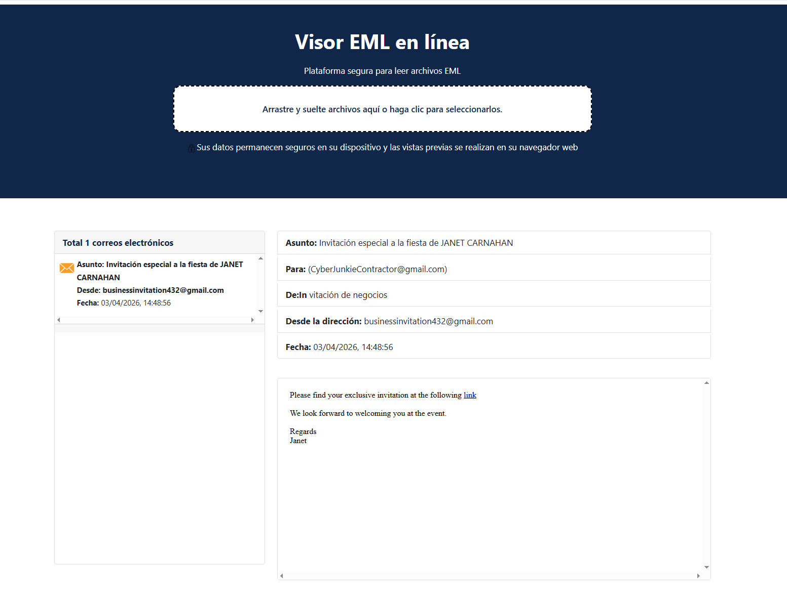

---

# 2. Identificación de la URI maliciosa

## Objetivo

Determinar a qué sitio fue redirigido el usuario.

## Procedimiento

Al montar la imagen identifiqué que el navegador utilizado era **Microsoft Edge**, por lo que analicé su base de datos `History` utilizando **DB Browser for SQLite**.

La siguiente consulta permite convertir el formato **FILETIME** utilizado por Chromium a una fecha legible.

```sql
SELECT
datetime(last_visit_time/1000000-11644473600,'unixepoch') AS Fecha,
url,
title,
visit_count
FROM urls
ORDER BY last_visit_time DESC;
```

De esta manera fue posible localizar la URL visitada por el usuario y responder la pregunta.

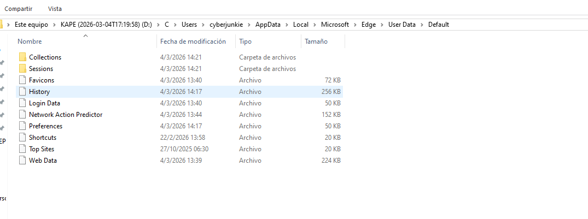
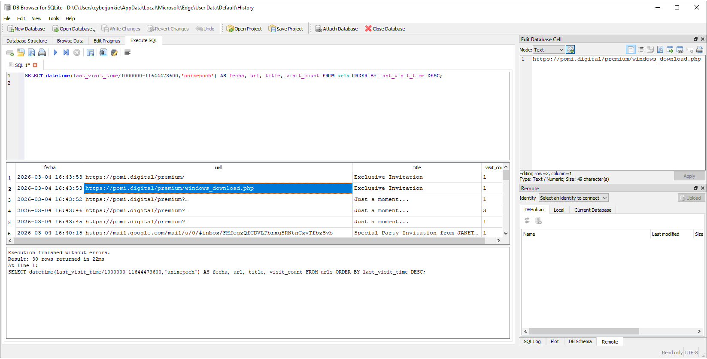
---

# 3. Archivo descargado

## Objetivo

Identificar el archivo descargado desde el sitio malicioso.

## Procedimiento

Continuando con el análisis de la base SQLite, consulté la tabla `downloads`.

```sql
SELECT * FROM downloads;
```

La consulta permitió identificar el ejecutable descargado por la víctima junto con su ruta original.

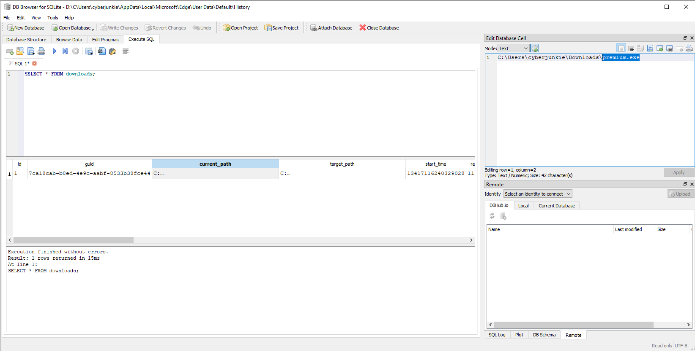

---

# 4. Evidencia de ejecución mediante Amcache

## Objetivo

Determinar cuándo fue ejecutado el malware.

## Procedimiento

Para esta pregunta analicé el archivo:

```
C:\Windows\AppCompat\Programs\Amcache.hve
```

Utilizando **Registry Explorer** de Eric Zimmerman busqué el ejecutable previamente identificado.

Amcache conserva información relacionada con aplicaciones ejecutadas y permitió obtener la fecha de ejecución del archivo.

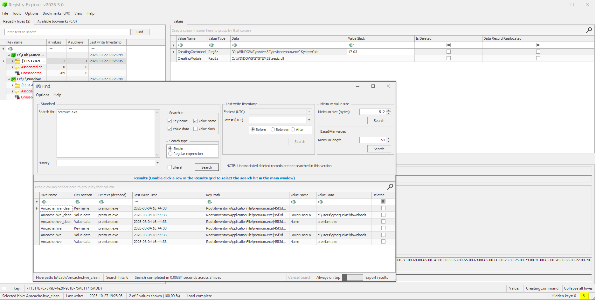

---

# 5. Obtención del SHA256

## Objetivo

Recuperar el hash SHA256 del ejecutable.

## Procedimiento

Esta fue una de las preguntas que más tiempo llevó resolver.

Inicialmente analicé el archivo **Prefetch** utilizando **PECmd**, lo que confirmó la ejecución de `premium.exe` y reveló su ruta original.

Posteriormente utilicé **MFTECmd** para analizar el `$MFT`, donde también aparecía una entrada correspondiente a:

```
C:\Users\cyberjunkie\Downloads\premium.exe
```

Sin embargo, el ejecutable ya no se encontraba presente dentro de la imagen, por lo que no era posible calcular directamente su SHA256.

A partir del **SHA1 almacenado en Amcache**, realicé una búsqueda en **VirusTotal**, obteniendo finalmente el SHA256 solicitado.

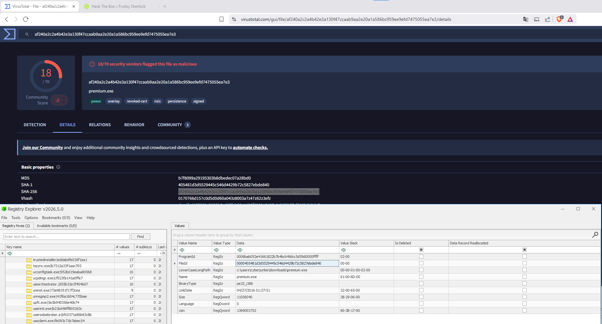

---

# 6. Microsoft Defender

## Objetivo

Determinar cuándo el usuario inició un análisis con Microsoft Defender.

## Procedimiento

Inicialmente revisé los archivos `MPLog` y `MPDetection`, aunque los horarios no coincidían con la respuesta esperada.

Finalmente consulté los registros de eventos de Windows (`Windows Defender Operational.evtx`) teniendo en cuenta los ID de Windows Defender y advertí que el **Visor de Eventos mostraba las fechas en UTC**, mientras que otros artefactos se encontraban en hora local (UTC-3).

Una vez corregida la diferencia horaria fue posible identificar el momento exacto en que comenzó el análisis.

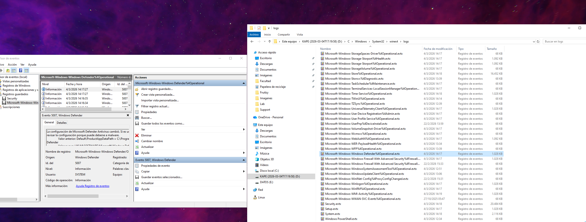
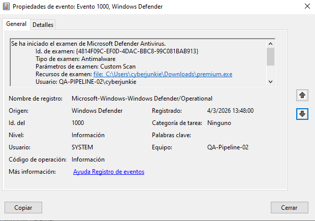
---

# 7. Identificación del servicio RMM

## Objetivo

Determinar el servicio instalado por el malware.

## Procedimiento

Analicé el hive **SYSTEM** con Registry Explorer y revisé las entradas de:

```
RMM
```

Buscando referencias al software instalado encontré el servicio **CAGService**, perteneciente a **CentraStage**, una solución RMM utilizada para administración remota.

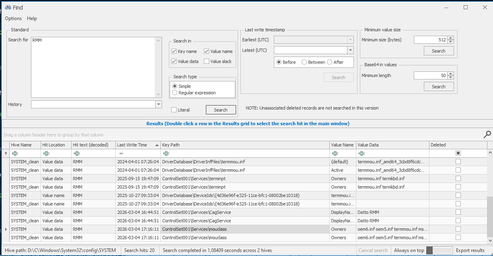
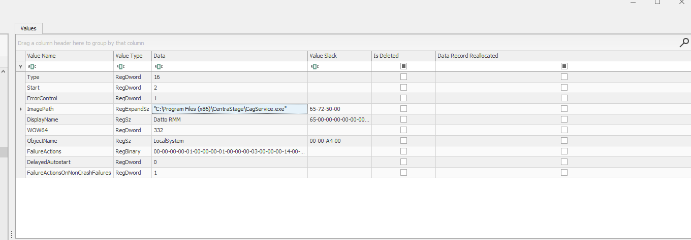
---

# 8. Time Stomping

## Objetivo

Determinar el timestamp falsificado aplicado a los ejecutables.

## Procedimiento

Utilicé nuevamente el `$MFT` procesado con **MFTECmd**.

Buscando archivos pertenecientes a **CentraStage**, observé que múltiples ejecutables y bibliotecas compartían una misma fecha de modificación muy anterior a la instalación real.

Esto evidenciaba una técnica de **Time Stomping**, utilizada para dificultar el análisis forense.

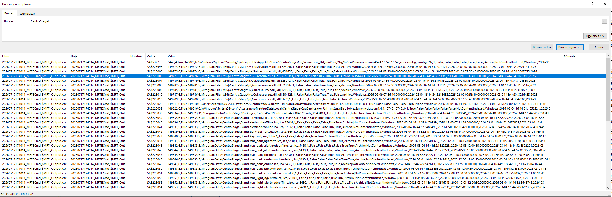

---

# 9. Identificación del software RMM

## Objetivo

Identificar el software instalado.

## Procedimiento

A partir del servicio encontrado anteriormente investigué **CentraStage**, confirmando que corresponde a **Datto RMM**, una plataforma de monitoreo y administración remota frecuentemente utilizada también por actores maliciosos para mantener persistencia.


---

# 10. Registro del dominio

## Objetivo

Determinar cuándo fue registrado el dominio malicioso.

## Procedimiento

Con la URL obtenida durante el análisis del navegador consulté **VirusTotal**, donde fue posible acceder a la información histórica del dominio y obtener su fecha de registro.

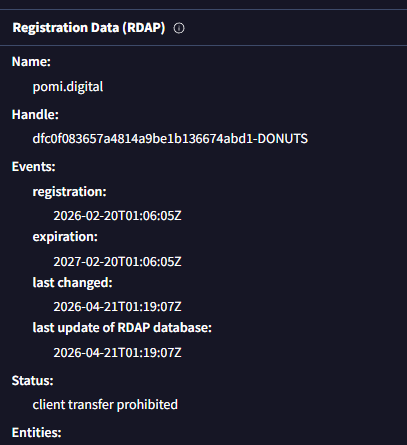

---

# 11. Threat Intelligence

## Objetivo

Identificar otros nombres conocidos del malware.

## Procedimiento

Finalmente utilicé el **SHA256** recuperado para consultar VirusTotal.

La información proporcionada por distintos motores antivirus permitió identificar otros nombres utilizados para referirse al mismo ejecutable malicioso.

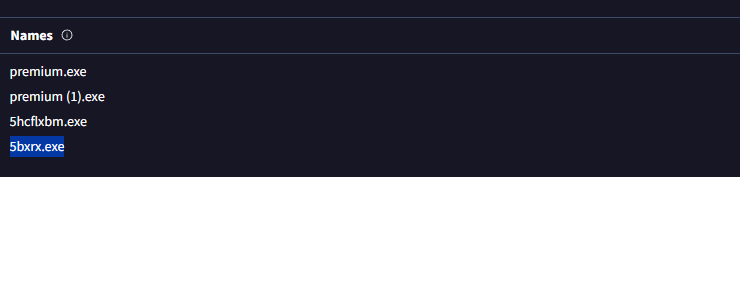

---

# Conclusiones

Este Sherlock permitió poner en práctica el análisis de múltiples artefactos forenses de Windows, entre ellos el historial de Microsoft Edge, Amcache, Prefetch, `$MFT`, el Registro de Windows y los logs de Microsoft Defender.

Uno de los aspectos más interesantes fue la correlación de distintas fuentes de evidencia para reconstruir la actividad del usuario, incluso cuando el ejecutable original ya no se encontraba disponible dentro de la imagen. El uso combinado de herramientas de Eric Zimmerman y plataformas de Threat Intelligence permitió completar la investigación y responder todas las preguntas del desafío.
